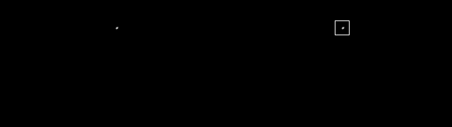

# Shooting Star Generator
This is a python script that generates synthetic shooting star images.
By combining resulting shooting star images with some appropriate background images or movies,
you can train shooting star detector.
Of course, you can use it as screensaver movie or any other purposes.

## Results

## Algorithm
TODO